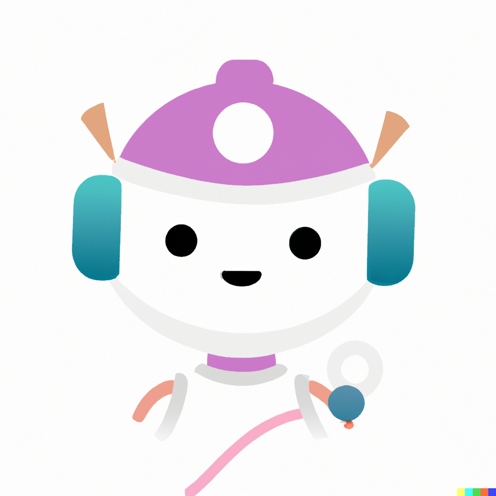

<h1 align="center">
    <a href="https://github.com/codinasion/good-1st-issue">
        
    </a>
    <br>
    Good 1st Issue
    <br>
</h1>

<h4 align="center">Github App + Website + Twitter Bot</h4>

<p align="center">
  <a href="https://github.com/apps/good1stissue" >
    ?logo=github" alt="Github App" />
  </a>
  <a href="https://good1stissue.codinasion.org/">
    ?logo=bot" alt="good1stissue.codinasion.org" />
  </a>
  <a href="https://twitter.com/Good1stIssue">
    
  </a>
</p>

<p align="center">
  <a href="#about">About</a> •
  <a href="#github-app">App</a> •
  <a href="#website">Web</a> •
  <a href="#twitter-bot">Bot</a> •
  <a href="#contributing">Contributing</a>
</p>

## About

Good 1st Issue helps you find good first issues to contribute to open source projects.

It consists of a [Github App](https://github.com/apps/good1stissue), a [website](https://good1stissue.codinasion.org/) and a [Twitter Bot](https://twitter.com/Good1stIssue).

## [Github App](https://github.com/apps/good1stissue)

The [Github App](https://github.com/apps/good1stissue) can be installed on repositories that want to be featured on the website and Twitter Bot.

Every time a new issue is labeled with `good first issue` the [Github App](https://github.com/apps/good1stissue) will post the issue on the website and Twitter Bot.

You can install the Github App on your repository by [clicking here](https://github.com/apps/good1stissue).

> **Note** The Github App will ask for `Read` access to your repository. This is needed to read the issues (and labels) of your repository.

The Issues will be autometically `deleted` from the website and Twitter Bot when the issue is `closed` / `deleted` / `unlabeled` / `assigned` to ensure that the website and Twitter Bot **only show issues that are still open for contribution**.

The Source Code of the Github App is available  in [`app/index.ts`](app/index.ts)

## [Website](https://good1stissue.codinasion.org/)

The [website](https://good1stissue.codinasion.org/) contains a list of all the issues that are currently labeled with `good first issue` on the repositories that have the Github App installed.

The Source Code of the website is available in [`pages/index.js`](pages/index.js)

## [Twitter Bot](https://twitter.com/Good1stIssue)

The [Twitter Bot](https://twitter.com/Good1stIssue) posts a new issue every 5 minutes (if there is any).

It may take few minutes/hours for the issue to appear on the [Twitter Bot](https://twitter.com/Good1stIssue) (but it will appear on the [**website**](https://good1stissue.codinasion.org/) in just few seconds/minutes), depending on the number of issues that are in queue to be posted.

The Source Code of the Twitter Bot is :point_down: here

```python
# install tweepy
# pip install tweepy

# import the necessary packages
import tweepy

# create twitter client
client = tweepy.Client(
    consumer_key="TWITTER_CONSUMER_KEY",
    consumer_secret="TWITTER_CONSUMER_SECRET",
    access_token="TWITTER_ACCESS_TOKEN",
    access_token_secret="TWITTER_ACCESS_TOKEN_SECRET",
)

# create a tweet
message = client.create_tweet(text="Hello World !!!")
```

## Contributing

If you want to contribute to this project, please read the [CONTRIBUTING.md](CONTRIBUTING.md) file.
