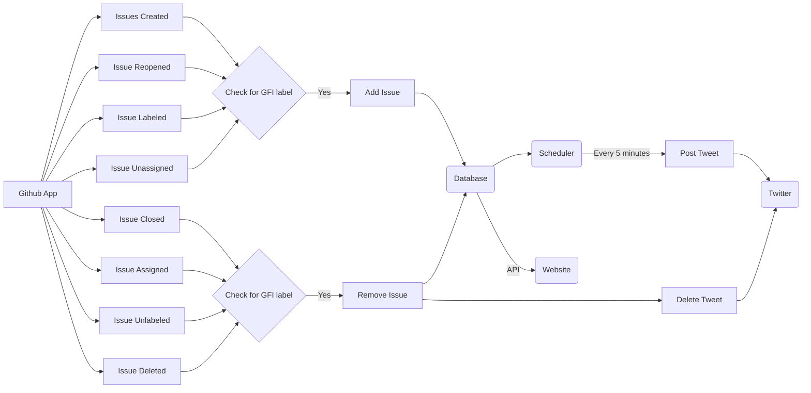

# Workflow for the project

The basic workflow for the project can be described as follows:

```mermaid
graph LR
A1[Github App] --> A2[Issues Created]
A1 --> A3[Issue Reopened]
A1 --> A4[Issue Labeled]
A1 --> A5[Issue Unassigned]
A2 --> B1{Check for GFI label}
A3 --> B1
A4 --> B1
A5 --> B1
B1 -->|Yes| B2[Add Issue]
B2 --> DB(Database)

A1 --> C1[Issue Closed]
A1 --> C2[Issue Assigned]
A1 --> C3[Issue Unlabeled]
A1 --> C4[Issue Deleted]
C1 --> D1{Check for GFI label}
C2 --> D1
C3 --> D1
C4 --> D1
D1 -->|Yes| D2[Remove Issue]
D2 --> DB
D2 --> D3[Delete Tweet]
D3 --> TW(Twitter)

DB --> E1(Scheduler)
E1 --> | Every 5 minutes | E2[Post Tweet]
E2 --> TW

DB --> | API | WB(Website)
```
